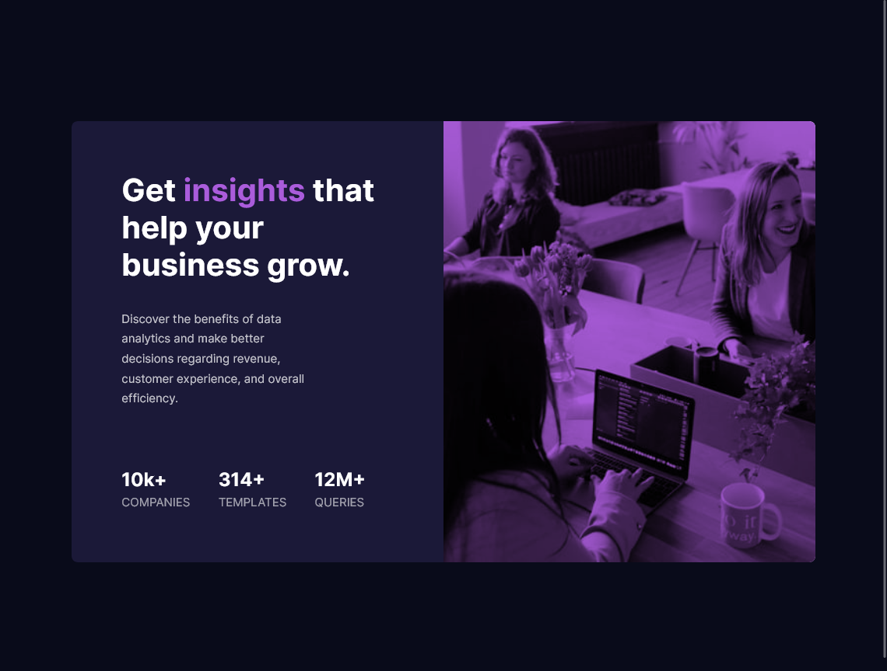
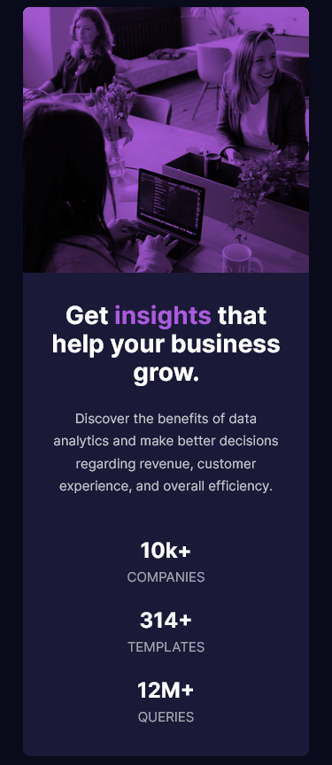

# Frontend Mentor - Stats preview card component solution

This is a solution to the [Stats preview card component challenge on Frontend Mentor](https://www.frontendmentor.io/challenges/stats-preview-card-component-8JqbgoU62). Frontend Mentor challenges help you improve your coding skills by building realistic projects.

## Table of contents

- [Frontend Mentor - Stats preview card component solution](#frontend-mentor---stats-preview-card-component-solution)
  - [Table of contents](#table-of-contents)
  - [Overview](#overview)
    - [The challenge](#the-challenge)
    - [Screenshot](#screenshot)
  - [My process](#my-process)
    - [Built with](#built-with)
    - [What I learned](#what-i-learned)
  - [Author](#author)

## Overview

### The challenge

Users should be able to:

- View the optimal layout depending on their device's screen size

### Screenshot




## My process

### Built with

- Flexbox
- CSS Grid
- Background Blend Mode

### What I learned

Grid and background blend mode.

```css
.header {
  grid-area: header;
  background-image: url(./images/image-header-desktop.jpg);
  background-color: var(--accent-color);
  background-repeat: no-repeat;
  background-position: center;
  background-size: cover;
  border-radius: 0 0.5rem 0.5rem 0;
  background-blend-mode: multiply;
}
```

## Author

- Website - [Abuzer Emre Osmanoğlu](https://abuzeremre.com)
- Github - [@aeosmanoglu](https://github.com/aeosmanoglu)
- Frontend Mentor - [@aeosmanoglu](https://www.frontendmentor.io/profile/aeosmanoglu)
- Twitter - [@abuzeremreo](https://www.twitter.com/abuzeremreo)
- LinkedIn - [@ae-osmanoglu](https://www.linkedin.com/in/ae-osmanoglu/)
